# Portfolio 
Yep, just the source code for my portfolio web, to flex my Vue capability that I just learned 3 days ago. Feel free to use anything here if anything ever seem useful for you (Which most likely won't).

## Installation
Clone the repository, and install all dependencies
```bash
git clone http://github.com/idfp/ports
cd ports
npm install
```
Then run development server with
```
npm run dev
```
Or build into compact HTML-JS-CSS files.
```
npm run build
```
that's it, nothing fancy.

Then, let me thanks [@Gowee](https://github.com/Gowee/) for their beautiful [Nyancat SVG](https://github.com/Gowee/nyancat-svg) that I use as a decoration, with some slight modification. (Sorry for modfying it into grayscale :) )


